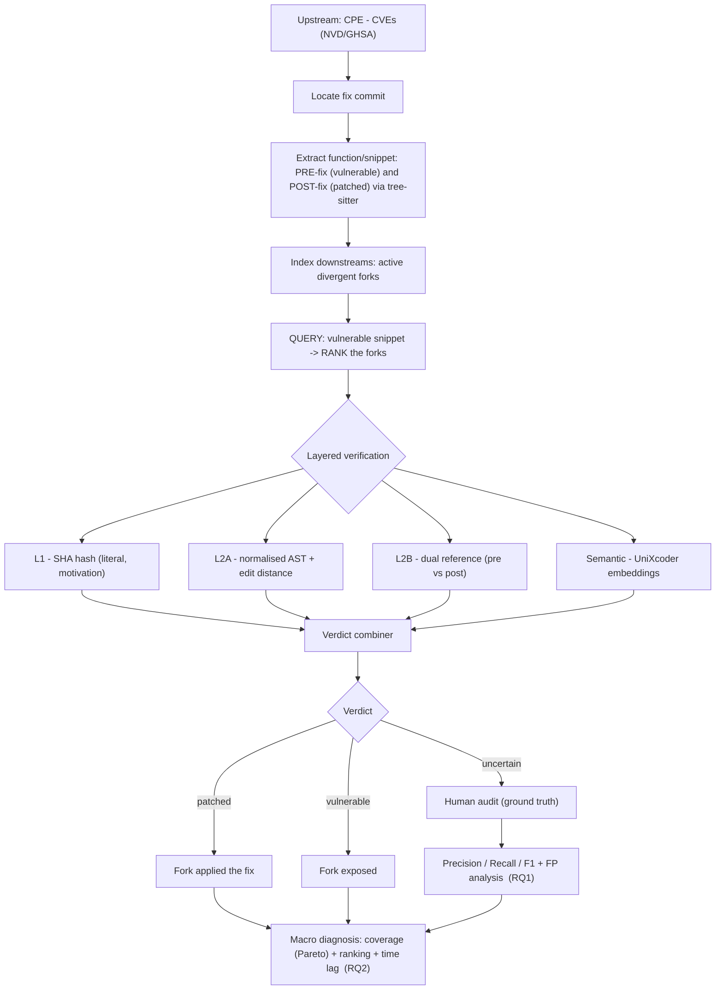

# Consolidated report — experiments, related work and methodology

> **Purpose.** A single document explaining (1) the related work and how we reproduced it,
> (2) every experiment carried out and its methodology, (3) the research methodology we
> present (the target *to-be* process), (4) the process flow and (5) the process diagram.

## Contents

1. [Context and research questions](#1-context-and-research-questions)
2. [Related work](#2-related-work)
3. [Experiments](#3-experiments)
4. [Detailed technical methodology](#4-detailed-technical-methodology)
5. [Research methodology (to-be process)](#5-research-methodology-to-be-process)
6. [Process flow (to-be)](#6-process-flow-to-be)
7. [Process diagram](#7-process-diagram)
8. [Synthesis of results](#8-synthesis-of-results)
9. [Limitations and next steps](#9-limitations-and-next-steps)
10. [Artefact index](#10-artefact-index)

---

## 1. Context and research questions

The goal is to **automatically verify whether security fixes (CVE patches) from the
original project (*upstream*) have propagated to the divergent *forks*** of the Matrix
ecosystem, and to characterise that propagation. The target user is the **maintainer of a
divergent fork** who needs to know whether the upstream CVEs still affect their code.

**Research questions:**
- **RQ1 (method):** To what extent can vulnerability-fix propagation be detected
  automatically in fork-based development? (focus: tool reliability — precision/recall).
- **RQ2 (empirical study):** What are the characteristics of fix propagation to downstream
  forks in the Matrix ecosystem? (focus: how, how often and how fast fixes arrive).

**Design.** The approach moves from "pure AST" towards **clone detection / semantic
similarity with ranked search** (query with the vulnerable snippet → ranked list of
downstreams). The commit hash is used **only as motivation** that literal matching is
insufficient. The study has **two phases**: (1) validation with one upstream per leg —
client, server, library; (2) scale-up to the whole ecosystem.

---

## 2. Related work

Five state-of-the-art works anchor the method. Each was **reproduced as an executable
baseline** over the same Matrix fork data (not merely cited), so the comparison is
empirical.

| # | Work | Core idea | Role in our pipeline |
|---|----------|---------------|-------------------------|
| 1 | **Wyss et al. 2022** — *What the Fork?* (ICSE) | Clone detection by **whole-file hash** (npm) | **Layer 1** (literal verification) — baseline / motivation |
| 2 | **Cheng et al. 2025** — *VERCATION* (IEEE TSE) — **the closest work** | **Normalised AST** + edit distance to identify vulnerable/patched versions | **Layer 2A** (structural similarity) — our declared starting point |
| 3 | **He et al. 2024** *PPTFI* / **Xu et al. 2023** *PatchDiscovery* | **Patch Presence Test (PPT)** with **dual reference** (compares against pre- and post-patch) | **Layer 2B** (dual reference) — discriminator for the uncertainty zone |
| 4 | **See et al. 2025** (ACM AsiaCCS) | Contextual similarity + **greedy optimisation** | **Macro diagnosis** — greedy set cover → Pareto curve |
| 5 | **Decan et al. 2018** / **Ponta et al. 2020** | **Technical lag / window of vulnerability** | **Time lag** — how fast forks react |

Additional grounding: Businge et al. 2022 (divergent forks, *variability percentage* >
90%), Wu et al. 2024 (*Vision*, affected versions), SourcererCC/NIL/Siamese (clone
search), and the classical clone tools (CCFinder/CCFinderSW, NiCad, MSCCD) evaluated in
the tool study.

---

## 3. Experiments

Seven experimental blocks, in execution order. All artefacts live in dated directories so
runs never mix.

### Exp 0 — Reproducing the related work (baselines)
- **Goal:** turn each related work into a measurable baseline over the Matrix forks,
  against the ground truth (34 conclusive fork×CVE pairs).
- **Method:** each technique is applied in isolation to the already mined dataset
  (`dissertation_resultados.json`); each pair's verdict is the **union** over
  files/commits; we measure **recall** (how many real fixes each method detects).
- **Results (recall over 34 pairs):** hash (Wyss) **0.147**; dual-reference PPT (PPTFI)
  **0.324**; AST (VERCATION) **0.676**. Greedy (See): coverage ceiling **68.8%** reached
  with **5 forks** (56.2% with 3). Time lag (Decan): **median 244 days** (min −14, max
  578; n = 29). → `trabalhos_relacionados/`.

### Exp 1 — Study of clone-detection tools
- **Goal:** decide which clone tools (CCFinder, NiCad, Type-3/ranking) to adopt, knowing
  that **language support constrains the dataset**.
- **Method:** review plus a **language × tool** matrix crossing the Matrix languages
  (Python, Rust, Kotlin, Swift, TypeScript, Go) with each tool's support and mode (pairwise
  detection vs. ranked search).
- **Result:** **Python** is the only language fully supported by all of them; Rust, Kotlin
  and Swift require a *grammar-pluggable* tool (MSCCD/ANTLR) or **embeddings**.
  Recommendation: start Phase 1 with the **server/synapse (Python)** leg; NiCad as a
  ground-truth detector; **embeddings (UniXcoder)** as the search/ranking engine;
  CCFinder+hash as motivation. → `estudo_ferramentas_deteccao_clones.md`.

### Exp 2 — Embedding search/ranking prototype (synapse)
- **Goal:** materialise the ranked-search pipeline (query with the vulnerable snippet →
  ranking → verdict) with **code embeddings (UniXcoder)** on the server leg.
- **Method:** for one CVE, extract the **changed function** (pre and post fix); the
  reference is the **diff snippet**; each fork is aligned by a **sliding window** inside
  the same function; the verdict comes from **semantic dual reference** (closer to the
  vulnerable or to the patched image).
- **Result:** on **CVE-2024-31208** (which the AST layer had left in the uncertainty zone —
  false negatives), the **3 forks are classified as patched** (Δ +0.185), with the upstream
  sanity checks passing. That is: **embeddings resolve the AST layer's false negatives**.
  → `prototipo_ranking_embeddings/run.py`.

### Exp 3 — Scale-up to the ecosystem (embeddings vs. baselines)
- **Goal:** run the ranker over **all CVEs × forks of the 5 categories** and compare it
  head to head with hash/AST/dual-reference against the ground truth.
- **Method:** robust extraction via **tree-sitter** (reusing `pipeline_core.py`), union
  aggregation, recall per method and per category.
- **Result (recall, 34 pairs):** hash 0.147 · dual-ref 0.324 · AST 0.676 ·
  **embeddings 0.794** · **union AST ∪ embeddings 1.000**. Complementarity: the embeddings
  **rescue exactly where the AST layer collapses** — synapse/Python (0/3 → 3/3) and
  matrix-rust-sdk/Rust (1/9 → 9/9); the AST layer dominates in Kotlin and in one TypeScript
  project. → `prototipo_ranking_embeddings/run_ecosystem.py` + `RESUMO_ecossistema.md`.

### Exp 4 — Precision evaluation (negative set, combiner, calibration)
- **Goal:** close the "recall only" gap by measuring **real precision** and evaluating the
  combiner and the margin (the false-positive analysis).
- **Method:** a **two-class** set — positives (upstream@fix + forks confirmed patched) and
  **negatives** (upstream@pre, vulnerable by construction, + forks at their **pre-adoption**
  version). Each instance receives an AST verdict and an embedding verdict; margin sweep;
  union/intersection combiner.
- **Result:** on the full set **every method sits at P ≈ 0.5** (the earlier "zero false
  positives" was an artefact of a positives-only ground truth). **Key diagnosis:** on
  **provably vulnerable** code (upstream@pre), embeddings err on only **13%** (P ≈ 0.96)
  against **47%** for the AST layer — the precision drop comes from the noisy pre-adoption
  fork negatives. The **margin does not fix** the false positives (plateau ~0.55); best
  standalone F1 = **embeddings (0.700)**; the union maximises recall (1.0) with the worst
  precision (0.489). → `run_precision_eval.py` + `RESUMO_precisao.md`.

### Exp 5 — Preparing the manual audit
- **Goal:** enable **human validation** of the negative set, since the aggregate precision
  is a **floor** (pre-adoption negatives are noisy).
- **Method:** `montar_worklist_auditoria.py` generates a worklist of the **56 negatives**
  (46 **disputed** = some method called the vulnerable code patched), with links to the fix
  commit and to the file in the fork, plus blank columns for the human verdict;
  `calcular_auditoria.py` recomputes P/R/F1 over the human labels.
  → `prototipo_ranking_embeddings/auditoria_negativos_worklist.csv`.

### Exp 6 — Human audit of the ground truth + anchoring on the corrective line
- **Goal:** validate the ground truth against human judgement and test the **validity of
  the ground truth itself** — whether the automatic "patched" verdicts rest on the line
  that **actually** fixes, rather than on noise (imports, docstrings, enum variants).
- **Method:**
  1. **Audit worklist.** From `gt_dissertation_resultados.json` we generated a navigable
     worklist (`auditoria_manual_gt.html` + `.csv`) with the **43 fork×CVE pairs**, each
     carrying: a link to the upstream **fix commit**, a link to the **fork's file at HEAD**,
     the key lines the ground truth searched for (marked present/absent, with similarity),
     the ground-truth label, the automatic (AST) verdict, and a field for the **human
     verdict**.
  2. **Human audit.** The reviewer walked the 43 pairs, prioritising the **11 false
     negatives** (ground truth says patched, AST left it in the uncertainty zone).
  3. **Assisted review of the 11 FN.** For each, the real fix-commit diff and the fork file
     at HEAD were downloaded, and the presence of the **line that effectively fixes** (not
     imports) was checked. Result: the **11 FN are correct ground truth** — the fork does
     carry the real fix; the AST layer was merely conservative.
  4. **GT v2 — corrective anchoring.** For **all 16 CVEs** a **corrective anchor** was
     extracted from the diff (the line/token that exists only if the fix is present) and the
     43 pairs were revalidated **offline** against the already downloaded files
     (`evidencias_gt_dissertacao/`). Rule: PATCHED if the anchor is present (union across
     fix commits). Artefacts: `gt_v2_resultados.json`, `gt_v2_metricas.json`,
     `VALIDACAO_GROUND_TRUTH.md`; regenerate with `gt_v2_anchors.py --check`.
- **Result:**
  - **The 9 ambiguous cases of GT v1 were an artefact of matching imports and generic
    lines.** Anchored on the corrective line they all resolve to PATCHED: 3× CVE-2025-61672
    (the absences were only `import`s), 3× CVE-2025-66622 (`warn!("Encountered a custom
    join rule")` present), 3× CVE-2023-43656 (fix **migrated between files**, see below).
  - **The ground truth went from 34/43 conclusive to 43/43** (0 ambiguous), **all PATCHED,
    0 vulnerable**. GT v2 metrics: **Precision 1.000 · Recall 0.605 · F1 0.754 · Kappa 0.0**
    (against GT v1: P 1.000 · R 0.676 · F1 0.807).
  - **Methodological finding (file restructuring).** CVE-2023-43656 (hookshot) appeared to
    provide the missing *vulnerable* class; on investigation, the fix had **migrated** from
    `GenericHook.ts` to `src/generic/WebhookTransformer.ts` (verified across the 3 forks:
    `shouldInterruptAfterDeadline` ×2, QuickJS ×5, `vm2` = 0). It was a **false-vulnerable
    by restructuring** — the same limitation documented for element-web (monorepo), now
    **intra-repository**.

### Exp 7 — Content-based audit of the negative set and adoption at HEAD
- **Goal:** deliver the **definitive precision** by correcting the negative labels, and
  answer RQ2 directly: did the forks adopt the patches?
- **Method:** instead of structural similarity, each negative instance is compared against
  the **PRE-image** (context + removed lines) and the **POST-image** (context + added lines)
  reconstructed from the most changed hunk of the diff. Shared context makes the decision
  discriminative even for small patches.
- **Result — and this supersedes the aggregate precision of Exp 4:**
  - **The date-based "pre-adoption" negative set is contaminated.** 33 of the 56 negatives
    have `sim_post = 1.00`: the patched image appears **literally** in the file. Cause:
    divergent forks merge/cherry-pick from upstream and git **preserves the upstream
    committer date**, so the inclusive `until = fix_date` cut-off lets the fix commit in and
    the supposed "pre-adoption" version already carries the patch. Nearly every "false
    positive" of Exp 4 was the method **correctly** detecting a present fix.
  - **Definitive precision** over 51 conclusive audited negatives: embeddings
    **P 0.972 · R 0.896 · F1 0.932**; AST 2A P 0.914 · R 0.961 · F1 0.937; combiner
    **P 0.906 · R 1.000 · F1 0.951**. Precision rises from ~0.50 (raw) to **0.91–0.97**.
  - **Adoption at HEAD (RQ2):** of 38 pairs evaluated in their current state, **24 adopted**
    the fix, 14 are indeterminate (patch too small to discriminate), and **0 remain
    demonstrably vulnerable**.
  - Caveat: this is automated triage; the 5 indeterminate cases and final sign-off remain
    with the human reviewer. → `RESUMO_auditoria.md`, `auditoria_adocao_HEAD.csv`.

---

## 4. Detailed technical methodology

### 4.1 Layered verification pipeline
1. **Layer 1 — literal (SHA).** Hash equality of the post-fix file between upstream and
   fork. Fast and unambiguous, but **fails on divergent forks** (renames and refactorings
   change the hash) → high false-negative rate. **Used as motivation.**
2. **Layer 2A — structural (AST).** Parsing with **tree-sitter**; normalisation
   (identifiers→VAR, strings→STR, numbers→NUM, loops→LOOP); similarity by **Levenshtein**
   over the in-order serialisation plus **Zhang-Shasha** (tree edit distance, 600-node
   limit). Classification: **≥ 0.80 → patched**; **≤ 0.35 → not patched**; in between →
   **uncertainty zone**.
3. **Layer 2B — dual reference.** `delta = sim_post − sim_pre`; **|delta| ≤ 0.05 →
   uncertainty zone**; otherwise the sign of the closer reference decides. Corrects false
   positives on code-**removal** patches.
4. **Semantic layer — embeddings (UniXcoder).** `microsoft/unixcoder-base` in the official
   **`<encoder-only>`** mode plus normalised mean pooling (without the mode token the cosine
   degenerates). Function extraction by **tree-sitter**; reference = the **diff snippet**;
   alignment by **sliding window** inside the function; **patch presence** = independent
   maximum of similarity to the vulnerable and to the patched image; calibrated margin
   (0.02 → 0 at best F1).

### 4.2 Aggregation and macro diagnosis
- **Union rule:** an (upstream, fork, CVE) triple is patched if **any** file/commit of that
  CVE matches (backports and cherry-picks count).
- **Macro coverage:** fork × (upstream, CVE) matrix + **greedy set cover** → Pareto curve
  ("K forks guarantee X%").
- **Time lag:** days between the upstream fix commit and adoption in the fork.

### 4.3 Metrics and validation
- **RQ1:** Precision / Recall / F1 / Kappa against the **ground truth** (automatic + manual
  audit), with emphasis on **false-positive analysis** (the "false sense of security" risk).
- **RQ2:** coverage per category, proactivity ranking, time lag.
- The **uncertainty zone** is a *feature*: it escalates to human audit instead of forcing a
  binary verdict.

### 4.4 Fixed parameters
| Parameter | Value |
|-----------|-------|
| PATCHED threshold (2A) | sim ≥ 0.80 |
| NOT-PATCHED threshold (2A) | sim ≤ 0.35 |
| Uncertainty-zone margin (2B) | \|δ\| ≤ 0.05 |
| Zhang-Shasha node limit | 600 |
| Embeddings | UniXcoder `<encoder-only>`, 16-line window, calibrated margin |
| Top forks per upstream | 3 (active divergent, `ahead_by > 0`) |

### 4.5 Construction and validation of the ground truth (two evidence layers)

The ground truth is **not** a loose manual label: it is built by a procedure independent of
the method under test and then **audited by a human**. Two versions:

- **GT v1 (patch lines).** For each (fork, CVE, fix commit): extract the added/removed lines
  from the real upstream diff, normalise, and search them in the fork's file (normalised
  exact + fuzzy ≥ 0.85). Label by fraction present: **≥ 0.70 → PATCHED**, **≤ 0.30 →
  VULNERABLE**, in between → **AMBIGUOUS**. Limitation: the first lines of a diff are
  usually imports/docstrings/context → **confidence contaminated by noise**.
- **GT v2 (anchored corrective line).** For each CVE, **one anchor** is defined — the line
  or token that exists only if the security fix is present (e.g. `should_accept_forward`,
  `visited_chains`, `Some(i) if i != sender`,
  `validate_json_object(body, self.KeyUploadRequestBody)`,
  `warn!("Encountered a custom join rule")`). PATCHED if the anchor appears (union across
  fix commits). This is the recommended ground truth: it eliminates the ambiguous cases and
  avoids "false patched" verdicts caused by imports. **Validity requirement:** the anchor
  must be corrective code, not context.

**Human audit.** A navigable worklist (`auditoria_manual_gt.html`) with links to the fix
commit and the fork's file, plus the 11 FN checked line by line. Human × GT v2 agreement is
total on the conclusive cases; the human divergences (e.g. CVE-2025-66622) were **induced by
generic lines** and disappear under GT v2.

The uncertainty zone and `FILE_NOT_FOUND` remain *features*: they escalate to audit rather
than forcing a verdict. GT v2 also exposes the **false-vulnerable by file restructuring**
(the fix migrates path between the commit and the fork's HEAD), motivating project-level
ranked similarity search that is not bound to a fixed path.

---

## 5. Research methodology (to-be process)

What we defend is an **analytical pipeline for verifying patch propagation in divergent
forks**, with a **two-phase** empirical design and verification over **multiple evidences**,
whose differentiators are **complementarity** (structural + semantic) and **escalation to
human audit** under uncertainty.

**Principles (validated by the experiments):**
- **Literal (hash) matching is insufficient** → it serves as motivation (recall 0.147).
- **AST and embeddings are complementary** → their union reaches recall 1.000; each covers
  different languages and patch shapes (AST strong in Kotlin/TypeScript; embeddings rescue
  Rust/Python).
- **Precision depends on label quality.** On the raw negative set every method sits at
  P ≈ 0.5; once the contaminated labels are corrected by content audit, precision rises to
  **0.91–0.97**, and the combiner reaches recall 1.000 with F1 0.951.

**Phase 1 — validation (one upstream per leg: client, server, library).** Build the ground
truth, measure precision/recall/F1 and analyse false positives. Answers **RQ1**.

**Phase 2 — scale (whole ecosystem).** With the tool validated, characterise the
propagation: coverage, proactivity ranking, time lag. Answers **RQ2**.

---

## 6. Process flow (to-be)

1. **Mining.** From the upstream product's CPE, obtain the CVEs (NVD/GHSA) and locate the
   **fix commit** (scanning references; cross-mining NVD↔GHSA to compensate for the ~70%
   of missing links).
2. **Target extraction.** Retrieve the code **before** the fix and extract, via
   **tree-sitter**, the **vulnerable** (pre) and **patched** (post) function/snippet.
3. **Downstream indexing.** Select the **active divergent forks** (`ahead_by > 0`, recent
   activity) and index their corresponding files.
4. **Ranked search.** Query with the **vulnerable snippet** → **rank** the forks by
   similarity (most similar = candidate still vulnerable).
5. **Layered verification.** Apply Layer 1 (hash, motivation) → 2A (AST) → 2B (dual
   reference) → semantic (embeddings); **combine** the verdicts.
6. **Decision.** patched / vulnerable / uncertainty zone. Uncertainty **escalates to human
   audit** (stratified sample → ground truth).
7. **Metrics.** Precision/Recall/F1 + false-positive analysis (RQ1).
8. **Macro diagnosis.** Coverage matrix + greedy set cover (Pareto) + time lag →
   characterisation of the ecosystem (RQ2).

---

## 7. Process diagram

### 7.1 Flowchart (Mermaid — renders on GitHub/VS Code)



### 7.2 Flowchart (ASCII — fallback)

```
            UPSTREAM (CPE -> CVEs, NVD/GHSA)
                       |
              locate the fix commit
                       |
   extract PRE-fix (vulnerable) and POST-fix (patched) function   [tree-sitter]
                       |
        index downstreams (active divergent forks)
                       |
     QUERY: vulnerable snippet  ->  RANK the forks
                       |
        +--------------+-----------------------------+
        |           LAYERED VERIFICATION             |
        |  L1 hash  ->  L2A AST  ->  L2B dual ref.   |
        |            ->  Semantic (embeddings)       |
        +--------------+-----------------------------+
                       |
                   COMBINER
                       |
        +--------------+--------------+
        |              |              |
     PATCHED       VULNERABLE     UNCERTAINTY
    (fixed it)      (exposed)          |
        |              |          HUMAN AUDIT -> ground truth
        |              |               |
        +------+-------+---------------+
               |
   MACRO DIAGNOSIS: coverage (Pareto) + ranking + time lag
   METRICS: Precision / Recall / F1 + FP analysis
        (RQ1 = reliability | RQ2 = characterisation)
```

### 7.3 Experimental arc

```
Exp0 baselines  ->  Exp1 tool study  ->  Exp2 embedding prototype
  (reproductions)    (language limits data)   (synapse: fixes AST false negatives)
     ->  Exp3 ecosystem scale  ->  Exp4 precision/negatives  ->  Exp5 audit worklist
           (union AST+emb = 1.0)     (raw P ~0.5; clean ~0.96)     (human worklist)
     ->  Exp6 human audit + anchored ground truth (GT v2)
           (43/43 conclusive, 0 ambiguous; validates the 11 FN and Kappa=0)
     ->  Exp7 content audit of the negatives + adoption at HEAD
           (labels corrected -> P 0.91-0.97; 0 forks demonstrably vulnerable)
```

---

## 8. Synthesis of results

**Validated ground truth (Exp 6 — human + GT v2 anchored on the corrective line):**

| | GT v1 (patch lines) | **GT v2 (corrective line)** |
|---|:---:|:---:|
| Conclusive pairs | 34 / 43 | **43 / 43** |
| Ambiguous | 9 | **0** |
| PATCHED / VULNERABLE | 34 / 0 | 43 / 0 |
| TP · FP · FN · TN | 23·0·11·0 | 26·0·17·0 |
| Precision · Recall · F1 | 1.000 · 0.676 · 0.807 | **1.000** · 0.605 · 0.754 |
| Kappa | 0.0 | 0.0 |

The 9 ambiguous cases were an artefact of import matching; the human audit confirms the 11
FN as correct (a limitation of the AST layer, not of the ground truth). **Kappa 0 is a real
property of the population** (active divergent forks track upstream — there are no natural
negatives), which is why real precision is measured on constructed negatives.

**Recall per method (34 fork×CVE pairs with conclusive ground truth):**

| Method (source work) | Recall | TP |
|-------------------|:------:|:--:|
| hash (Wyss 2022) | 0.147 | 5 |
| dual-reference PPT (PPTFI 2024) | 0.324 | 11 |
| AST (VERCATION 2025) | 0.676 | 23 |
| **Embeddings (UniXcoder)** | **0.794** | 27 |
| **Union AST ∪ embeddings** | **1.000** | 34 |

**Complementarity per category (TP / n):**

| Category (upstream) | Lang. | AST | Embeddings |
|----------------------|:-----:|:---:|:----------:|
| client (element-android) | Kotlin | **9/9** | 6/9 |
| bridge (matrix-appservice-irc) | TS | **10/10** | 6/10 |
| integration (matrix-hookshot) | TS | 3/3 | 3/3 |
| **server (synapse)** | Python | 0/3 | **3/3** |
| **library (matrix-rust-sdk)** | Rust | 1/9 | **9/9** |

**Precision — raw two-class set (44 positives / 56 negatives):**

| Method | P | R | F1 |
|--------|:---:|:---:|:---:|
| AST 2A | 0.477 | 0.932 | 0.631 |
| AST 2B | 0.559 | 0.750 | 0.641 |
| **Embeddings (margin 0)** | 0.553 | 0.955 | **0.700** |
| Union (AST ∪ emb) | 0.489 | **1.000** | 0.657 |

**Precision — after auditing the negative labels (Exp 7; 51 conclusive negatives):**

| Method | P | R | F1 |
|--------|:---:|:---:|:---:|
| **Embeddings (UniXcoder)** | **0.972** | 0.896 | 0.932 |
| AST 2A | 0.914 | 0.961 | 0.937 |
| **Combiner (AST2A ∪ emb)** | 0.906 | **1.000** | **0.951** |

The raw ~0.5 was demonstrably an artefact of the contaminated negative set: 33 of the 56
"negatives" already contained the patch verbatim.

- **Macro diagnosis:** coverage ceiling **68.8%** with **5 forks** (Pareto); **median time
  lag 244 days** (max 578) — severe inertia across the network.
- **Adoption at HEAD:** 24 of 38 pairs confirm adoption; **0 forks remain demonstrably
  vulnerable**.

---

## 9. Limitations and next steps

**Limitations:**
- **Precision on small patches / divergent forks** remains the bottleneck: vulnerable ≈
  patched at function granularity. Neither the margin nor the combiner resolves it; what
  resolved it here was correcting the labels, which does not generalise automatically.
- **Date-based negative sets are unreliable.** Cherry-picks preserve the upstream committer
  date, so a "pre-adoption" snapshot can already contain the fix. Any future negative set
  must be validated by content, not by date.
- **512-token truncation** in UniXcoder and extraction fragility (mitigated by tree-sitter
  and the sliding window).
- **File restructuring between the fix and the fork's HEAD** breaks fixed-path verification:
  the fix migrates file (element-web → monorepo; hookshot CVE-2023-43656 →
  `WebhookTransformer.ts`) and checking the old path yields **false-vulnerable /
  FILE_NOT_FOUND**. Detected and worked around by hand in Exp 6; motivates project-level
  search.
- **Ground-truth validity depends on the corrective anchor:** a ground truth built on raw
  patch lines (imports/docstrings) produces ambiguity and can mislead even the human
  auditor. Mitigated by GT v2.
- **3 of the 43 GT v2 labels rest on a manual cross-file check** (CVE-2023-43656), because
  only the pre-migration file was archived as evidence. `gt_v2_anchors.py --no-manual`
  reports what the anchors establish without it.

**Next steps:**
1. **Human sign-off** of the 5 indeterminate cases left by the content audit.
2. **Line-level discrimination** (Type-3/near-miss clone tools — NiCad — and ranked search)
   for small patches.
3. **Calibrated combiner** (not the raw union): optimise F1 (recall × precision).
4. **Project-level ranked search** not bound to a file path, to handle restructuring.

---

## 10. Artefact index

**Documents**
- **`RELATORIO_EXPERIMENTOS_E_METODOLOGIA.md`** — this document.
- `ANEXO_DIAGNOSTICO_C5_C6_C8.md` — threshold sensitivity, fix-commit provenance, cost.
- `estudo_ferramentas_deteccao_clones.md` — clone-detection tool study (Exp 1).

**Related-work reproductions (Exp 0)** — `trabalhos_relacionados/`
- `rw1_wyss2022_hash/`, `rw2_vercation2025_ast/`, `rw3_pptfi2024_dualref/`,
  `rw4_see2025_greedy_pareto/`, `rw5_decan2018_timelag/`
- `resultados_2026-07-08/` (JSONs + `RESUMO.md`)

**Prototype and scale-up (Exp 2–5, 7)** — `prototipo_ranking_embeddings/`
- `unixcoder_embed.py` (embeddings), `treesit_extract.py` (tree-sitter extraction)
- `run.py` (per-CVE prototype), `run_ecosystem.py` (scale), `run_precision_eval.py`
  (precision), `montar_worklist_auditoria.py` + `auditar_worklist_automatico.py` +
  `calcular_auditoria.py` (audit)
- `resultados_2026-07-09/` — `ecossistema_embeddings.json`, `precision_eval.json`,
  `auditoria_metricas.json`, `auditoria_adocao_HEAD.csv`, `RESUMO_ecossistema.md`,
  `RESUMO_precisao.md`, `RESUMO_auditoria.md`

**Ground truth and human audit (Exp 6)** — `resultados_2026-07-04/`
- `auditoria_manual_gt.html` / `.csv` — navigable worklist of the 43 pairs.
- `gt_v2_resultados.json` / `gt_v2_metricas.json` — ground truth anchored on the corrective
  line (per-CVE anchors + metrics).
- `VALIDACAO_GROUND_TRUTH.md` — validation report (GT v1 vs v2, anchor table, findings).
- `gt_dissertation_resultados.json` / `gt_dissertation_metricas.json` — GT v1 (baseline).

**Shared core**
- `pipeline_core.py` (AST, tree-sitter, similarity), `pipeline_dissertation.py` (Phase 2),
  `ground_truth.py` (GT v1), `gt_v2_anchors.py` (GT v2, offline),
  `sensibilidade_limiares.py`, `bench_custo_embeddings.py`.
